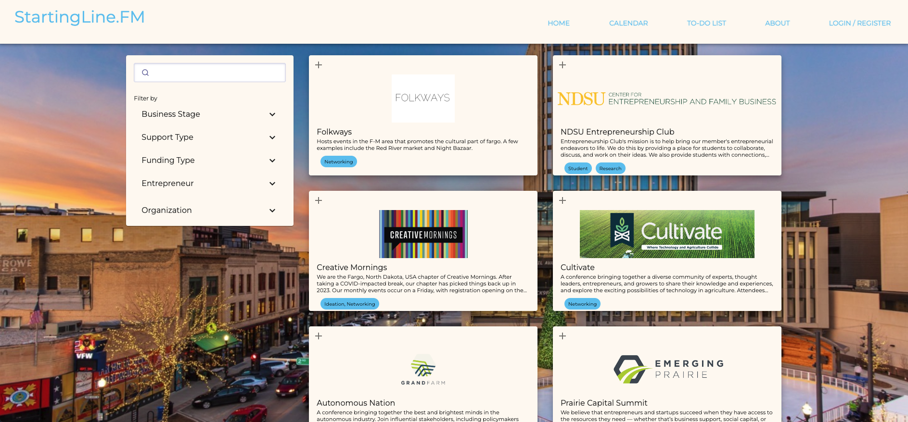
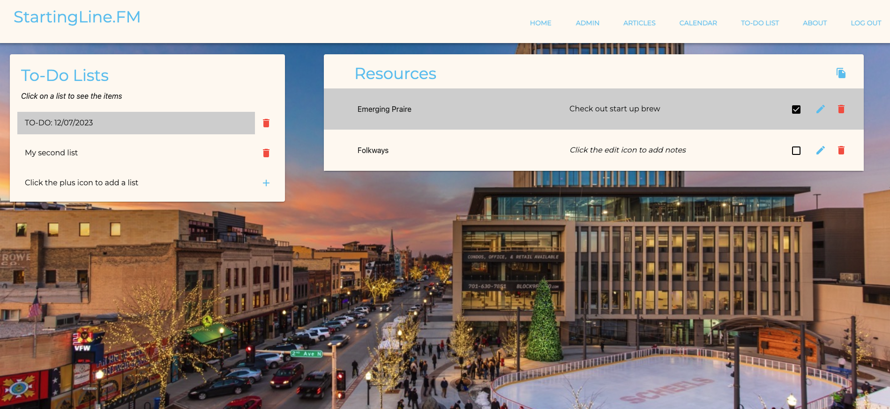
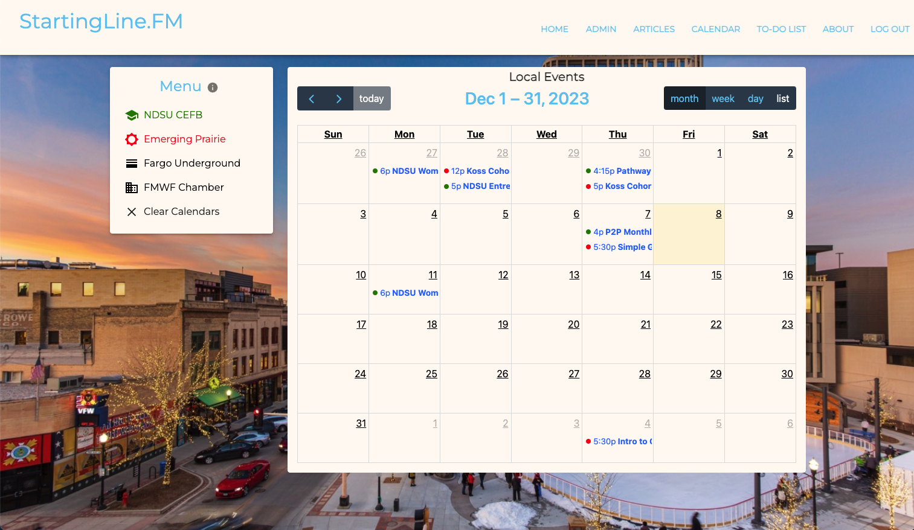
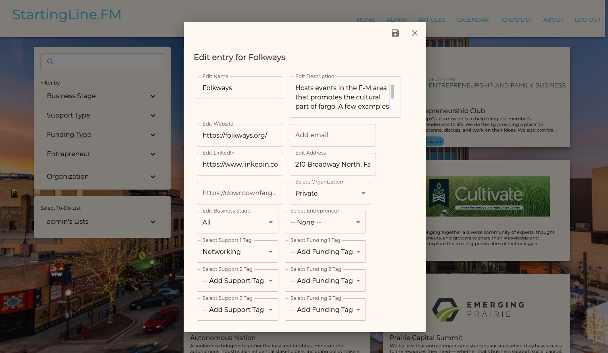
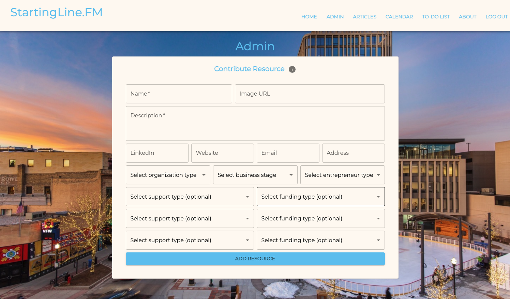
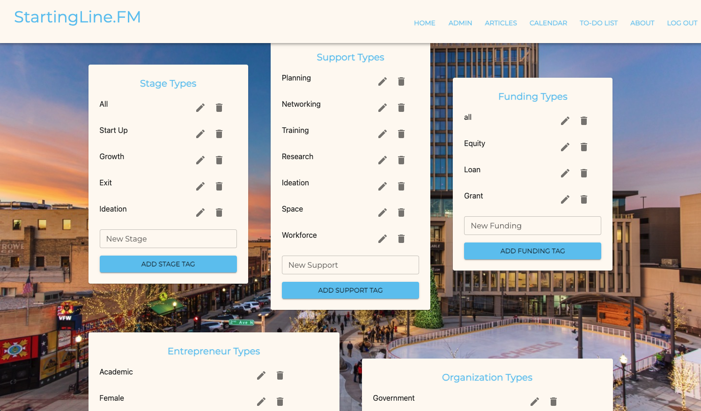

## Welcome to StartingLine.FM!

StartingLine.FM is a web app with the budding entrepreneur in mind!
It's an online hub for entrepreneurial growth for those in the Fargo, Moorhead, West Fargo North Dakota (FMWF) area.
This appllication was built by Emerging Digital Academy's Jolitz cohort as a client project for NDSU's center for entrepreneurship and family business during the Summer of 2023.
The application aims to provide a centralized location for local resources.
As of Winter 2023 it is now integrated with Algolia for a more thorough search experience. 

The application has four primary components.

1. The landing page where you search out resources that come in as cards, which can then be saved to a to-do list.
2. The to-do list where all saved resources will appear. Users can edit notes, mark done, and remove them. 
3. A calendar that scrapes different institutions web calendars to see local events. They are...
  -Emerging Prairie
  -Fargo Underground
  -FMWF Chamber of Commerce
  -NDSU CEFB (Added in Fall of 2023)
4. Finally, an admin mode to add, edit, and delete resources as well as all the tags that can be put on said resources. 

## Landing and Search Page

-The Landing Page presents the user with twenty resources upon arrival.
-Users may narrow down their results using the Search input which will query upon key stroke.
-The application shows twenty resources on screen at a time. This is to prevent uneeded charges and a paid plan by Algolia.
-Users can also access algolia refinement menus from the dropdowns on the left to better find what they're looking for using a system of five tags to better categoriaze resources.
-The result cards provide users with an at-a-glance view of the most relevant information for a resource: name, description, support, entrepreneur, and funding tags. 
-By clicking on the card itself, users will see a pop-up modal containing more details, including contact information. The full set of possible information fields in the result modal are as follows: name, description, website, linkedin, email, address, support tags, funding tags, entrepreneur tags, business stage tags, and organization tags(for example government).

## Here is a breakdown of StartingLineFM's tag system:
- Business Stage: What stage of the entrepreneurial process this resource best help.
- Support Type: What kind of support this resource can offer an entrepreneur.
- Funding TYpe: What kind of funding or funding assistance can be accessed here.
- Entrepreneur: Some resources cater to a specific entrepreneur type or demographic.
- Organization: What kind of institution this is; government, private, non-profit, etc.

## To-Do Lists & Different types of users:

 This to-do list page allows for users to create actionable steps to move toward their business goals. It provides a space for them to keep their resources that they thought would be a good fit for their business.

  This page works for two types of users.  

Anonymous (unregistered) user:
 1. An anonymous user arrives to their to-do list tab and sees a list of their resources 
 - Click the `edit icon` to edit resources by adding notes to particular resources.
 - Click the `delete icon` to delete resources off of their todo list if they want to remove a resource.
 - Click the `copy icon` to copy their list of resources and their notes(if there are any) to their clipboard to paste into a workflow of their choice.
 - Click `Click here to register an account` to keep their current to-do list and associated titles which will move onto the newly created account. 

Logged-in (registered) user:
 1. A logged in user arrives on their to-do list tab and is met with two tables one with ther todo lists and one with the associated resources. 
 - View their lists on the landing page and choose which list to add resources to. 
 - Make multiple lists by clicking the `+` to add a list title and clicking the save icon to save it. 
 - Edit particular resources using the `edit icon`. 
 - Delete particular resources using the `delete icon`.
 - check a resource when completed by checking the `box icon`.

## Calendar Page

The motivation behind this calendar was that of the rest of this project, an eventual one-stop shop for the entrepreneur. Scheduling and managing a calendar is key for any business professional. We wanted a single calendar that can pull in relevant business events from other institutions event calendars. This helps save a potential researcher time from navigating multiple internet browser tabs and calendars. 

-The calendar uses the Cheerio.js technology to scrape the relevant institutions web calendar. -On weekdays from 8 am to 6 pm, at the top of the hour, a cron job will scrape all four institutions web calendars and place it in StartingLine's postgres databases.
-Users can hit the info button right of "Menu" to see a guide on how to use the calendar.
-Press one of the four institution buttons on under the left menu to add their events to the   StartingLine calendar. Clicking the button again will toggle that institution off.
-Multiple institutions can populate the calendar at once; Emerging Prairie is Red, Fargo Underground orange, the chamber of commerce is purple, and NDSU CEFB is green. 
-The Clear button will simply toggle all institutions off clearing the calendar. 
-If you mouse over a calendar event you will see more details on that event. 
-Clicking the event will open your own google calendar and pre-populate the fields with what you saw when mousing over the event. 
-You can use the upper right buttons on the calendar to toggle a month, week, day, or list view. 
-The arrow buttons navigate through time windows. 
-The today button will take you back to the current day.
-The Calendar cron job is set up to not take duplicates and delete events over 12 months old.

## Admin Page

StartingLine users that are marked as admin gain access to two features.

1. Ability to edit or delete resources via the `edit icon` button in the Result modal.
-The admin can edit any of the data fields or properties of a resource and confirm with save.
-A resource must have an Organization and Business Stage and can only have one.
-A resouce can optionally have a single entrepreneur tag.
-A resource can have up to three support and up to three funding tags, or none at all.
-To remove support/funding tags, change the selector to the default -- add a tag -- option.
-Hit the save `disc icon` to confirm changes or the `X icon` to discard changes and leave the edit modal.
-This edits the resource in the database and then saves to synchronize with algolia. 

2.Admin Users can also access the admin tab/page, a robust administrative interface.
-Under the "Contribute Resource" form, new resources can be added to startingline's database which will synchronize with algolia's index. It then will appear on the landing page where it can be interacted with like any resource.
-Scrolling down a ways will show multiple forms/cards for each of the five tag types. Here an admin can add, edit, or delete any tag under the five tag types. 

ALGOLIA TECHNICAL NOTES:
1. Due to the need for Algolia to synchronize with postgres databases with the agoliaSave function; it make take a few seconds and a screen refresh for the adding/editing of resources and tags to appear on the application.
2. With the removal or addition of new tags; the facets of the index may need to be updated. 
3. All StartingLine administrators should be familiar with how to use this applications Algolia account and how to configure the index for desired search behavior. 
4. Remember to consult Algolia documentation when necessary.
