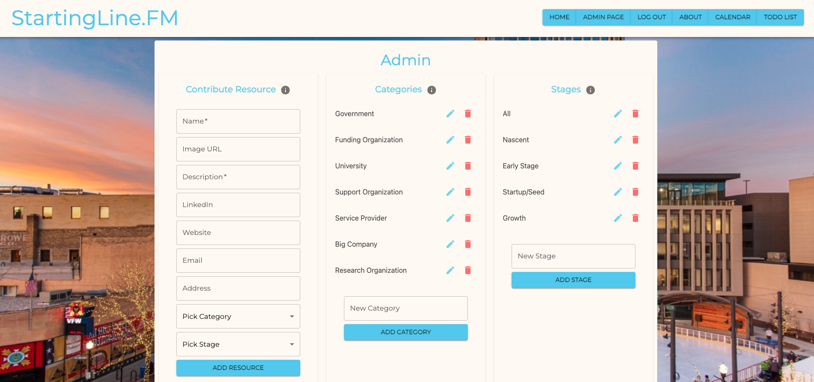

## Welcome to StartingLine.FM!

StartingLine.FM is a web app with the budding entrepreneur in mind!
It's an online hub for entrepreneurial growth for those in the Fargo, Moorhead, West Fargo North Dakota (FMWF) area.
This appllication was built as a client project for NDSU's department of business and entrepreneurship.
The application aims to provide a centralized location for local resources. 

The application has four primary components.

1. The landing page where you search out resources that come in as cards, which can then be saved to a to-do list.
2. The to-do list where all saved resources will appear. Users can edit notes, mark done, and remove them. 
3. A three in one calendar that scrapes three different institutions web calendars to see local events. They are...
  -Emerging Prairie
  -Fargo Underground
  -FMWF Chamber of Commerce
4. Finally, an admin mode to add, edit, and delete resources as well as business categories and stages. 

## Landing and Search Page

The Landing Page presents the user with a list of all resources available in alphabetical order upon arrival to the application.
Users may narrow down their results using any combination of the Search bar, Category filters, and Business Stage filters on the left-hand side of the page.
The result cards provide users with an at-a-glance view of the most relevant information for a resource: name, description, category, and applicable business stage. 
By clicking on the card itself, users will see a pop-up modal containing more details, including contact information. The full set of possible information fields in the result modal are as follows: name, description, website, linkedin, email, address, category, and business stage. 

There are additional functionalities depending on the type of user as well:

### Anonymous (unregistered) user:
Ability to add a resource to a temporary to-do list via the `+ icon` button

### Logged-in 
- Ability to select from all available user to-do lists via the "Select a To-Do List" sidebar
- Ability to add a resource to a selected to-do list via the `+ icon` button
- If a user does not have any to-do lists to select, one will be automatically added with a generic "TO-DO (current date)" title and set as the currently selected list upon clicking the `+ icon` button on a resource

### Admin
Ability to edit resource details via the `edit icon` button in the Result modal

## To-do List Page

 *** EYAN INSERTS HIS DESCRIPTION HERE ***
 This to-do list page allows for users to create actionable steps to move toward their business goals. It provides a space for them to keep their resources that they thought would be a good fit for their business. 

 This page works for two types of users. 

 ### Anonymous User
 1. An anonymous user arrives to their to-do list tab and sees a list of their resources 
 - Click the `edit icon` to edit resources by adding notes to particular resources.
 - Click the `delete icon` to delete resources off of their todo list if they want to remove a resource.
 - Click the `copy icon` to copy their list of resources and their notes(if there are any) to their clipboard to paste into a workflow of their choice.
 - Click `Click here to register an account` to keep their current to-do list and associated titles. 
 - 
 
 ### Logged In User
 1. A logged in user arrives on their to-do list tab and is met with two tables one with ther todo lists and one with the associated resources. 
 - View their lists on the landing page and choose which list to add resources to. 
 - Make multiple lists by clicking the `+` to add a list title and clicking the save icon to save it. 
 - Edit particular resources using the `edit icon`. 
 - Delete particular resources using the `delete icon`.
 - check a resource when completed by checking the `box icon`.

## Calendar Page

The motivation behind this calendar was that of the rest of this project, an eventual one-stop shop for the entrepreneur. Scheduling and managing a calendar is key for any business professional. We wanted a single calendar that can pull in relevant business events from other institution calendars. This helps save a potential researcher time from navigating multiple internet browser tabs and calendars. 

The calendar uses the Cheerio.js technology to scrape the relevant institutions web calendar. When you push one of the three institution buttons it launches an HTTP GET request to the relevant internet URL, Cheerio uses JQuery to scrape the relevant divs and spans,which are all consolidated into calendar block objects which are then put into an events array. The events array is the response to the client, they are placed into the relevant reducer which supplies data to the Fullcalendar.

Multiple institutions can populate the calendar at once; Emerging Prairie is Red, Fargo Underground orange, and the chamber is purple. The Clear button will wipe all events off allowing better clarity and curating. If you mouse over a calendar event you will see more details on that event. Clicking the event will open your own google calendar and pre-populate the fields with what you saw when mousing over the event. You can use the upper buttons to toggle a month, week, day, or list view. The arrow buttons navigate through time windows. The today button will take you back to the current day.

There are some significant vulnerabilities in this calendar to be aware of. Since the button press is what directly pulls the information, it will fail or break if that institution's calendar or webpage is down or reworked in the future (StartlingLine.FM was launched August 2023). 

## Admin Page

This Node.js Admin Router package is designed to streamline the management of administrative tasks related to three key data entities: Resources, Categories, and Stages. Encapsulating a series of RESTful API endpoints, the package provides the ability to execute CRUD (Create, Read, Update, Delete) operations for these entities, with each operation gated behind authentication and authorization middleware for secure and reliable administrative access control.

Key Features:
Resource Management: Leverage the API to create, read, update, and delete resource records. Each resource holds specific details such as stage_id, category_id, name, image_url, description, website, email, address, and LinkedIn URL.

Category Management: Manage categories through the dedicated endpoints that allow you to create, read, update, and delete category records. Each category consists of a unique name.

Stage Management: Utilize the API endpoints to create, read, update, and delete stage records. Each stage has a unique name and description.

Secure Access Control: With a two-tier middleware layer, access to administrative functions is tightly controlled. The rejectUnauthenticated middleware rejects non-authenticated users, while the isAdmin middleware checks the authenticated user's admin privileges, offering another layer of access control.

The Admin Router package ensures that all these operations are securely accessible to authenticated users who have been granted admin privileges, ensuring your sensitive operations remain secure and your data integrity uncompromised.

## Deployment

1. Create a new Heroku project
1. Link the Heroku project to the project GitHub Repo
1. Create an Heroku Postgres database
1. Connect to the Heroku Postgres database from Postico
1. Create the necessary tables
1. Add an environment variable for `SERVER_SESSION_SECRET` with a nice random string for security
1. In the deploy section, select manual deploy

## Update Documentation

Customize this ReadMe and the code comments in this project to read less like a starter repo and more like a project. Here is an example: https://gist.github.com/PurpleBooth/109311bb0361f32d87a2
